# 7. Analysis of the feature selection and model results

This document will cover the results of the feature selection methodes used to discover which genes will have the best data to be used for the models.

The feature selection methodes used are:
1. Literature
2. Statistical
3. Automated
4. Research
5. BORUTA
6. ExtraTree
7. Univariate

The models used for training are:
1. Logistic Regression
2. Random Forest
3. Support Vector Machine

# Literature
From the literature, 20 genes were marked to have a high association with tnbc. From there those genes were taken and standardized to be then used by the models to see how the model would predict tnbc with those genes.
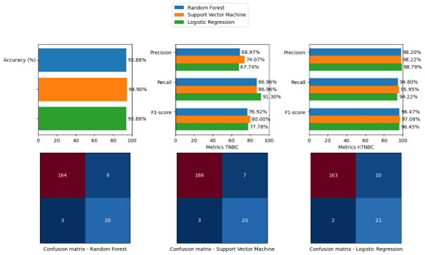
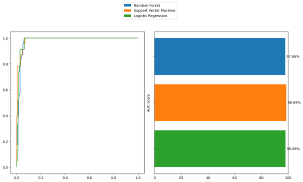
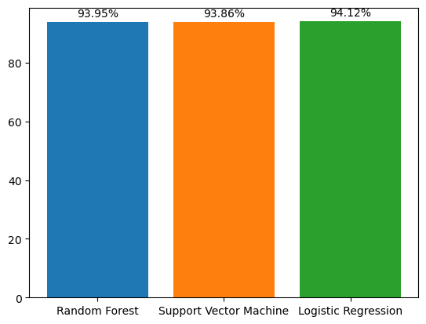

The plots show that the overall accuracy of the literature features is quite high will all 3 models.
But since the data is quite unbalanced, this score is quite misleading. Leaning heavily on the not TNBC cases, there is a low number of positive cases. Hench this data is not trust worthy.

But looking at their Precision, Recall and F1 score for predicting TNBC, some major differences show.
All models do not pass the 75% precision, but Support Vector Machine got the closet. Meaning with this feature selection SVM will have the least chance for calling false positives.
Incomparison to Random Forest and Logisitic Regression which hang around 64%, having almost a fifty-fifty chance to result in a false positive for TNBC.

However, Logistic Regression scores 91.30% on recall. This means that LR would be the best at capturing true positives.
SVM still scores pretty high with 86.96%. Looking at the F1-score, SVM scores 80.00%, meaning it has a very good balance between it's precision and recall scores.

For the ROC and AUC data, it shows that all models achieve high scores. Meaning they have found true positives with high speed and can tell what the distinction is between TNBC and not TNBC.
It's quite impressive it got these high results since the data is imbalanced. But still could mean that due to the large amount of True Negatives, it leans more to indentifying the True Negatives to the True Positives.

Just like the ROC and AUC data, the Cross Validation shows high scores. All the models reaching almost the 95%, with Logistic Regression having the highest with 94.12%. Meaning all the models would be able to produce similair results in practice as with the training/test data.

In conclusion the literature feature selection seems to result in an overall lower Precision to all models, while the ROC and AUC are quite high with the imbalanced data. Combined with the cross validation, the results seem realistic. 
If this feature selection were to be used, Support Vector Machine would be the best model to utilize.

# Automated
From the automated method of selecting genes, by using the PCA method, we transform the data and by selecting the most variating data, a new feature set is made. Officially this is not feature selection, but it will automatically help look for variables that impact the data.

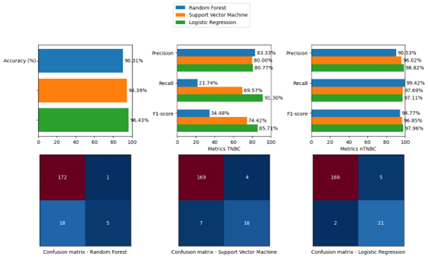
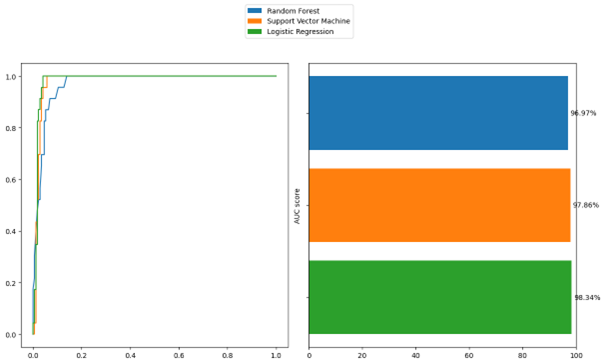
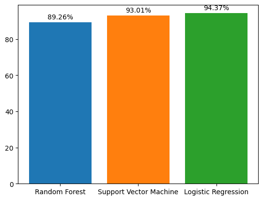

The accuracy of the models is pretty high, but Random Forest stands out for having a near 4% drop in performance compared to SVM. 90.31% compared to the others 94.39% and 96.43%, giving it quite the set back. The mostlikely cause is that because of the small pool of data and the lowered number of features created by the PCA. As Random Forest works better with structured data to create desicion trees, PCA restructures the original data that cannot be effectively used by the model.

Looking at the Presicion, Recall and F1-score we can see that the Random Forest model isn't compatible with PCA. While the Precision is the highest among the 3 models, the Recall score is very low, scoring 21.74% and the F1-score being 34.48%.
On the other hand, the Logistic Regression seems to excel with the features coming out of PCA. Mostlikely due to their similairities of finding variables and PCA eliminates high correlation in the data, which benefits Logistic Regression. Resulting in the high scores.

The ROC and AUC data support the findings above, as you can see the Random Tree has more curved line while Logistic Regression seems to sky rocket with True Positive Results. 

And the Cross Validation scores confirm the practical correctness of the Logistic Regression, scoring 94.37%.

In conclusion, Logistical Regression is the best model for the automated feature set. Because PCA has a similair algoritm of finding variables to Logistic Regression and PCA eliminates high correlation between the data which also favors Logistic Regression.

# Statistical
By conduction various checks to the correlation of the genes, features are being selected via statistics. This way the data is as normalized as possible and also have selected the most impactful and variable data.

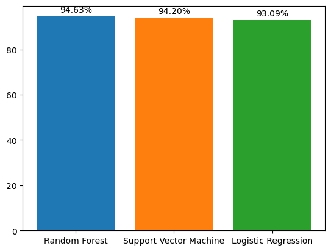

In terms of Accuracy, all models are very close, with Logistical Regression leading with 95.41%.
Looking at the Presicion, shares the same closeness as with the Accuracy, being between 74% and 79%. With LR having the highest again. Probably because variation plays a big role in the selection again, just like PCA. As mentioned above it will benefit the model.
For Recall, Random Forest has the highest score of 86.95%, where the other models share 82.61%. Still very high numbers, which solidifies the models ability to capture true positives.
This gets further confirmed by the F1-scores, which shows that the balance between Precision and Recall are fairly balanced around 80%.

Looking at the ROC AUC data, the True Positive Rate for all models is almost straight up, with LR having a bit of a curve.
The AUC scores are very high, showing near 100%. Showing that the model can almost distinct the TNBC and not TNBC cases at all times.

With the Cross Validation data we see that all models seem to be very accurate representations of practical results, being just below 95%. Random Forest being the most accurate representation.

In conclusion this feature set seems to work great with all the models. Having around the same scores seems the models have similair performances when utilizing this feature set.
Complementing to this is the high Cross Validation scores, estimating the reliability if put into practice.

# BORUTA
This feature selection method works by identifying relevant existing features and comparing them to randomly generated 'shadow' features. These are randomly generated features, which are then put to a model (usually Random Forest) to determine which features have high relevance.

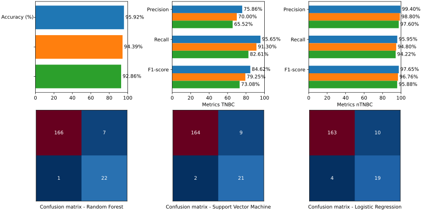
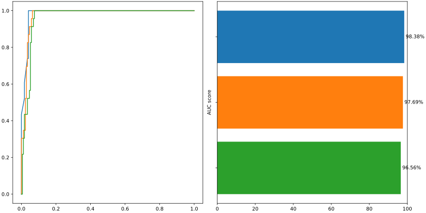
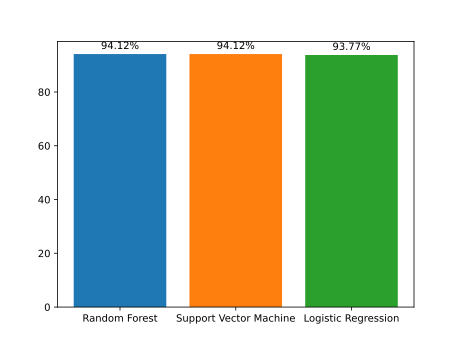

Looking at the Precision data, there are significant differences in performance. With Random Forest having the highest (75.86%), SVM having 70.00% and Logistic Regression having 65.52%. It seems Logistic Regression has trouble with this feature set, with the probable cause being a high correlation in the data.

The Recall scores seem more valuable, meaning all models having a high chance of True Positive capture.
Random Forest leads with 95.65%, SVM having 82.61% and Logistic Regression having 82.61%.
Another noticable drop in performance compared to the other models.

Looking at the F1-scores, it follows the same structure where Random Forest scores the highest with 84.62%, SVM following with 79.25% and Logistic Regression with the lowest score of 73.08%.

In conclusion, the BORUTA has some good features usable for the Random Forest model, being caused by the fact that the BUROTA algoritm uses Random Forest to select the most relevant features. Basically preparing the features for a Random Forest model.
But for the other models the results seem decent as SVM's results are average, but Logistic Regression scores lower due to the lack of features and structure the model excels at.

# LASSO
This feature selection, also known as L1 regularization, is an automated feature selection that selects the most relevant features by shrinking the coefficients of less important features to 0, basically removing them from the selection. It simplifies the model, prevents overfitting and improves interperability.

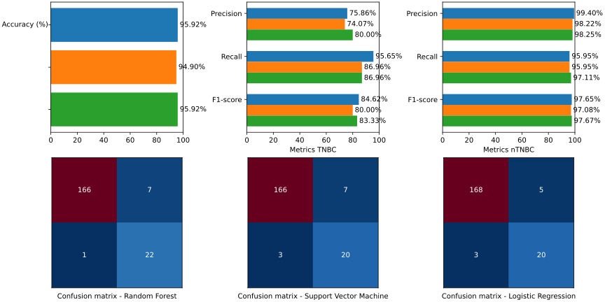
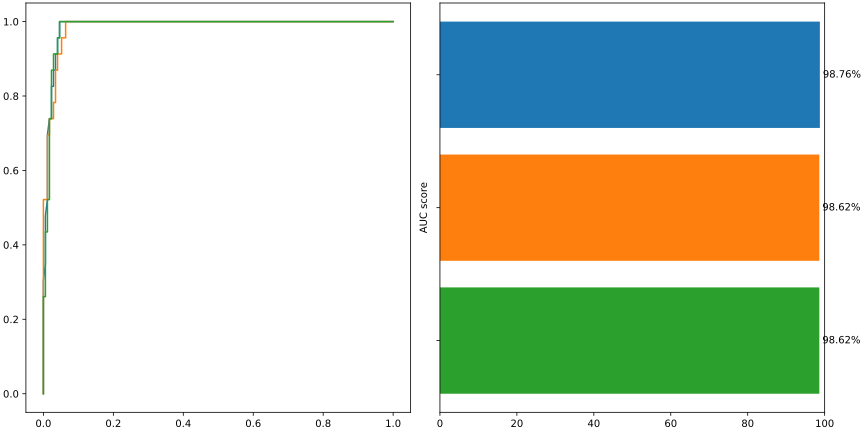
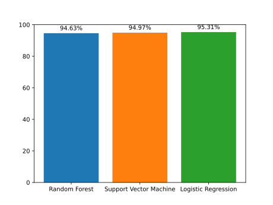

Looking at the Precision scores, they mostly score above the 75%, with Logistic Regression leading with 80.00%.
In contrast for Recall, Random Forest scores the highest with 95.65%, meaning although the accuracy is the lowest, it has the highest rate of True Positive captures. With SVM and Logistic Regression having a tie at 86.96%.
At the F1-scores, every model scores near each other, with Random Forest having the highest of 84.62%, Logistic Regression having 83.33% and SVM having 80.00%.

The ROC and AUC data rise quickly, although having a small curve near the top of the Y-axis. Still very good performance.
All models score high on the AUC, all passing the 98%. Meaning that all models have a great distinction between TNBC and non TNBC.

The cross validation shows that all models score aroundd 95%, having a good representation of a practical outcome.
Random Forest having 94.63%, SVM having 94.97% and Logistic Regression having the highest with 95.31%

In conclusion, the LASSO feature selection method has some decent balanced outcome to all models, but Random Forest and Logistic Regression show the most promising results out of the 3 models.

# Closing statement
It seems that most feature selection methods have certain aspects that positively affects one model and negatively impacts another.Great examples are Automated and BORUTA.
As such, most feature sets have a single model out performing the others. Like Literature with SVM, Automation with LR and BORUTA with RF.
However there were 2 feature set where 2 or all 3 models seem to perform almost equally to the feature set.
Like LASSO with RF and LR, but the Statistical feature set seemed to work well with all 3 the models looking at the statistics.
In the end, the one with the best overall metrics was LASSO.